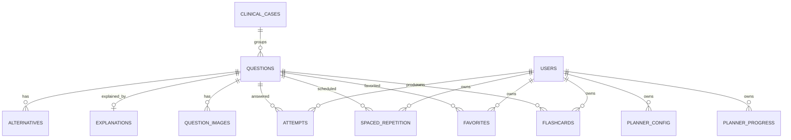

# Auditoria de backend — 2026-08-23

Escopo: `app/backend` (Flask, Python, SQLite/libSQL/Turso), testes, migrations e scripts. Esta revisão combinou análise estática, testes de integração e mudanças direcionadas. Ela não incluiu carga real contra produção nem acesso ao banco Turso de produção.

## Resumo executivo

- Suíte: 91 testes coletados na linha de base; após a revisão, 98 testes, todos aprovados.
- Linha de base: 89 aprovados e 2 falhas de consistência de artefatos/teste.
- Cobertura final do pacote `api`: **66%** (1.567/2.369 statements). O baseline numérico não existia porque `pytest-cov` não estava instalado.
- SQL injection: nenhuma interpolação de valor controlado pelo usuário foi encontrada. O SQL dinâmico usa placeholders; a única coluna dinâmica de mutação vem de um `Literal`/allowlist.
- Isolamento: consultas e mutações de tentativas, favoritos, SRS, planner e flashcards incluem `g.user_id`; testes cobrem isolamento entre convidados.
- O alvo de 80% de cobertura e métricas de latência de produção não foi atingido nesta revisão; não há dados para afirmar “90% dos endpoints abaixo de 200 ms”.

## Achados corrigidos

| Severidade | Achado | Correção |
|---|---|---|
| Alta | JWT aceitava a ausência de `exp`/`iss` e não validava issuer. | `exp`, `iss` e `sub` agora são obrigatórios; issuer e algoritmo RS256 são validados. Audience pode ser exigida via `CLERK_JWT_AUDIENCE`. |
| Alta | Qualquer caminho contendo `/images/` escapava do middleware de autenticação. | Exceção limitada aos prefixos públicos `/api/images/` e `/api/v1/images/`. |
| Alta | `FRONTEND_URL=*` habilitava CORS wildcard por configuração. | Startup falha fechado para `*`; múltiplas origens explícitas são aceitas. Credenciais CORS permanecem desativadas. |
| Alta | Geração batch de flashcards fazia cinco SELECTs por item e mantinha transação de escrita durante chamadas de IA. | Prefetch em três SELECTs totais, independentemente do tamanho do lote; IA executa antes da transação de escrita. |
| Média | Corpos de flashcards, simulado, favoritos e batch aceitavam campos arbitrários/tipos frágeis. | Schemas Pydantic com `extra=forbid`, limites de tamanho, enums e IDs positivos. |
| Média | Revisões concorrentes de flashcard liam o estado FSRS antes do lock de escrita. | Leitura e atualização foram movidas para a mesma transação imediata. |
| Média | Falha ao reportar flashcard devolvia a exceção interna ao cliente. | Resposta genérica e stack trace somente no log. |
| Média | Chamadas Groq não declaravam timeout/retry. | Timeouts de 8–10 s e uma retentativa configurados. |
| Média | Métricas operacionais eram visíveis a qualquer usuário autenticado. | Endpoint desabilitado sem `METRICS_API_TOKEN` e protegido por token dedicado. |
| Baixa | HTTPS não emitia HSTS. | HSTS é adicionado quando Flask reconhece uma requisição segura. |

## Banco e modelo de dados



`USERS` é uma entidade lógica externa (Clerk); o banco persiste apenas `user_id`. As operações multi-etapa relevantes usam `db_transaction`, com rollback explícito. Índices cobrem tentativas por usuário/questão/data, fila SRS, flashcards por usuário/data e filtros principais de questões.

Riscos restantes do banco:

- Não existe tabela de versão de schema nem runner de migrations; `init_db` mistura bootstrap e evolução aditiva.
- Os SQLs `002_user_id.sql` ainda documentam `INTEGER`, enquanto o runtime usa IDs Clerk `TEXT`; não devem ser reaplicados cegamente.
- Não há foreign keys declaradas nas tabelas de usuário criadas em runtime.
- Não foi possível executar `EXPLAIN QUERY PLAN` representativo contra produção; os testes usam um dataset mínimo.

## Performance e observabilidade

O batch de flashcards caiu de `5 × N` leituras para três leituras fixas. Listagens críticas já usam JOIN/batch e paginação/limites. O backend registra latência por rota, p50/p95 em memória, request ID, status e `Server-Timing`.

Lacunas:

- A geração de IA continua síncrona; mover lotes longos para uma fila com idempotência e polling.
- Cache é local ao processo e não é compartilhado entre workers.
- Logs não incluem tempo de query individual nem exportação OpenTelemetry.

## Segurança restante

- Rate limiting não está configurado. Prioridade: limitar autenticação/proxy, busca semântica e geração de flashcards usando storage compartilhado (Redis), não contador por processo.
- `CLERK_JWT_AUDIENCE` é opcional por compatibilidade; habilitá-lo quando o template de sessão emitir `aud`.
- A aplicação depende do proxy terminar TLS e encaminhar corretamente o esquema para HSTS. Configurar `ProxyFix` apenas com contagem de proxies conhecida.
- Não há RBAC administrativo porque o domínio atual não modela papéis.
- Rotação/revogação de segredos ocorre fora deste código; nenhum segredo rastreado foi encontrado (`.env` e `*.key` estão ignorados).

## Cobertura final

Principais gaps: `plan.py` 35%, `ai.py` 52%, `stats.py` 57%, `filters.py` 58%, `questions.py` 59% e `gemini_pool.py` 65%. Prioridade de testes: falhas/timeouts dos provedores de IA, todas as combinações de filtros, endpoints estatísticos e branches Turso.

`pip-audit -r requirements-web.txt` não encontrou vulnerabilidades conhecidas nas versões resolvidas em 2026-08-23.

Comando reproduzível:

```powershell
.venv\Scripts\python.exe -m pytest --cov=api --cov-report=term-missing --cov-report=json:coverage-final.json -q
```

## Scripts

O inventário encontrou 192 arquivos em `scripts/` (188 Python). Apenas o planejador integra o runtime; auditoria, reparo e sync de taxonomia formam o conjunto de manutenção testado. A política completa e a marcação deprecated por padrão estão em `app/backend/scripts/README.md`.
