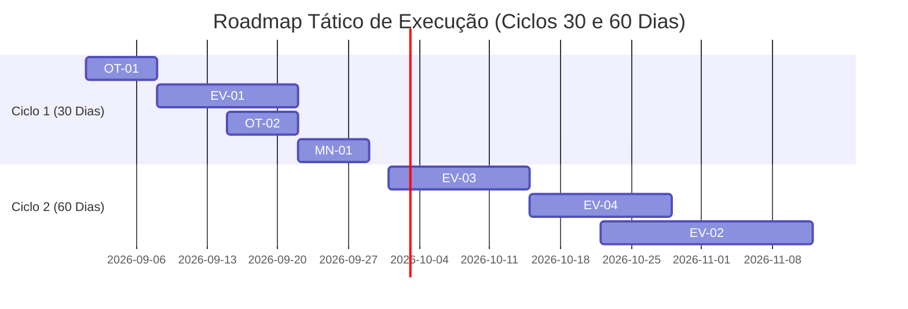

# Backlog Operacional Priorizado e Planejamento Tático (30–60 Dias) — MedQuest
**Versão:** 1.0  
**Data:** 01 de Setembro de 2026  
**Responsável:** Engenharia Líder & Gestão de Produto  

---

## 1. Objetivo

Consolidar o backlog contínuo do MedQuest organizado em 3 camadas operacionais (**Manutenção**, **Otimização** e **Evolução de Produto**), aplicando um método de priorização rigoroso e matemático baseado em Impacto, Confiança, Esforço e Risco (Score RICE Adaptado) com planejamento detalhado para os próximos 2 ciclos de desenvolvimento (30 e 60 dias).

---

## 2. Método de Priorização Operacional (Score RICE Adaptado)

$$\text{Score de Priorização} = \frac{\text{Impacto (1--5)} \times \text{Confiança (1--5)}}{\text{Esforço (P=1, M=2, G=3)} \times \text{Risco (1--3)}}$$

- **Impacto (1 a 5):** Ganho direto em retenção de alunos, velocidade ou estabilidade clínica.
- **Confiança (1 a 5):** Grau de certeza técnica e validação prévia da solução.
- **Esforço:** **P** = 1 ponto, **M** = 2 pontos, **G** = 3 pontos.
- **Risco (1 a 3):** 1 (baixo risco/isolado), 2 (médio risco/migração), 3 (alto risco/core transacional).

---

## 3. Backlog Consolidado em Camadas

### 3.1 Camada 1: Manutenção e Higiene Técnica (Hygiene & Robustness)

| ID | Descrição do Item | Impacto (1-5) | Confiança (1-5) | Esforço (P/M/G) | Risco (1-3) | Score | Dono Sugerido | Dependência |
| :--- | :--- | :---: | :---: | :---: | :---: | :---: | :--- | :--- |
| **MN-01** | Auditoria e expurgo de logs antigos em disco (> 30 dias) | 3 | 5 | P (1) | 1 | **15.0** | DevOps | Nenhuma |
| **MN-02** | Otimização periódica `PRAGMA optimize;` em bases SQLite | 3 | 5 | P (1) | 1 | **15.0** | Backend/DBA | Nenhuma |
| **MN-03** | Atualização contínua do dicionário de sinônimos médicos no FTS5 | 4 | 4 | P (1) | 1 | **16.0** | Especialista Clínico | `/api/search` |

---

### 3.2 Camada 2: Otimização e Escala (Performance & Infra)

| ID | Descrição do Item | Impacto (1-5) | Confiança (1-5) | Esforço (P/M/G) | Risco (1-3) | Score | Dono Sugerido | Dependência |
| :--- | :--- | :---: | :---: | :---: | :---: | :---: | :--- | :--- |
| **OT-01** | Compressão Brotli/Gzip em borda (reduz payload para < 7.5 KB) | 5 | 5 | P (1) | 1 | **25.0** | DevOps / SRE | Nginx/Cloudflare |
| **OT-02** | Lazy loading dinâmico de gráficos no `/desempenho` e `/cobertura` | 4 | 5 | P (1) | 1 | **20.0** | Frontend | `next/dynamic` |
| **OT-03** | Índices parciais para questões não resolvidas (`unanswered`) | 4 | 4 | M (2) | 1 | **8.0** | Backend/DBA | SQLite 3.8+ |

---

### 3.3 Camada 3: Evolução de Produto (Retenção, IA & Pedagógico)

| ID | Descrição do Item | Impacto (1-5) | Confiança (1-5) | Esforço (P/M/G) | Risco (1-3) | Score | Dono Sugerido | Dependência |
| :--- | :--- | :---: | :---: | :---: | :---: | :---: | :--- | :--- |
| **EV-01** | Notificações Push Web / PWA para lembrete matinal de SRS | 5 | 5 | M (2) | 1 | **12.5** | Fullstack | Service Worker |
| **EV-02** | Calibração Bayesiana Avançada de Probabilidade de Aprovação | 5 | 4 | G (3) | 2 | **3.3** | IA / Data Science | Dados de Editais |
| **EV-03** | Modo Simulado Offline Total com pré-download de 100 questões | 5 | 4 | M (2) | 2 | **5.0** | Frontend | Dexie / IndexedDB |
| **EV-04** | Análise comparativa de bancas (USP x ENARE x UNICAMP) no dashboard | 4 | 4 | M (2) | 1 | **8.0** | Fullstack | `/api/stats/breakdown` |

---

## 4. Planejamento dos Próximos 2 Ciclos (30 e 60 Dias)

### 4.1 Ciclo 1 (Próximos 30 Dias) — Foco em Retenção e Eficiência de Rede
1. **[OT-01] Compressão Brotli/Gzip em Borda (Score: 25.0):**
   - *Dono:* DevOps / SRE
   - *Objetivo:* Reduzir o tráfego de dados do app em 70% em conexões hospitalares móveis (4G/5G).
2. **[EV-01] Notificações Push PWA para Revisões SRS (Score: 12.5):**
   - *Dono:* Engenheiro Fullstack
   - *Objetivo:* Elevar a taxa de retenção D7 dos flashcards FSRS gerados pós-erro.
3. **[OT-02] Code-Splitting Adicional no `/desempenho` (Score: 20.0):**
   - *Dono:* Engenheiro Frontend
   - *Objetivo:* Manter o First Contentful Paint (FCP) de todas as rotas secundárias abaixo de 1.2s.
4. **[MN-01] Rotina de Expurgo de Logs e Otimização de Banco (Score: 15.0):**
   - *Dono:* Engenheiro Backend
   - *Objetivo:* Manter a estabilidade do disco e a velocidade das buscas SQLite em regime permanente.

---

### 4.2 Ciclo 2 (30 a 60 Dias) — Foco em Inteligência de Aprovação e Mobilidade
1. **[EV-03] Modo Simulado 100% Offline (Score: 5.0):**
   - *Dono:* Engenheiro Frontend
   - *Objetivo:* Permitir a realização completa de provas de 100 questões dentro de plantões sem sinal de internet.
2. **[EV-04] Radar Comparativo de Bancas de Residência Médica (Score: 8.0):**
   - *Dono:* Engenheiro Fullstack
   - *Objetivo:* Mostrar ao aluno em quais grandes áreas ele está competitivo para USP-SP vs ENARE vs UNICAMP.
3. **[EV-02] Calibração Bayesiana de Probabilidade de Aprovação (Score: 3.3):**
   - *Dono:* Especialista em IA / Estatística
   - *Objetivo:* Modelo preditivo probabilístico refinado com base no peso histórico real de cada edital.

---

## 5. Plano de Manutenção e Atualização Contínua do Backlog

- O backlog é reavaliado a cada 14 dias no Rito Quinzenal de KPIs.
- Itens concluídos são movidos para o histórico de entregas com registro da métrica de impacto gerada.
