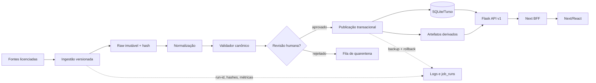

# Consolidação técnica: plano de 90 dias

Data: 2026-09-01. Escopo verificado no checkout local, sem acesso a produção.

## 1. Diagnóstico priorizado

### Mapa de módulos críticos

| Camada | Módulos/áreas | Responsabilidade e acoplamento relevante |
|---|---|---|
| Web | `app/frontend/src/app/{estudar,simulado,planner,revisao-ativa,analise}`, `src/lib/api.ts`, `src/lib/sync.ts` | Fluxos de estudo e offline; contratos HTTP são mantidos manualmente em TypeScript. |
| BFF | `app/frontend/src/app/api/[...path]/route.ts`, `src/lib/server-api.ts` | Proxy, autenticação interna e cache do Next; hoje possui fallback de URL de produção. |
| API | `app/backend/api/{questions,stats,plan,flashcards,sessions,notifications,auth,db}.py` | Blueprints Flask, Pydantic, idempotência e isolamento por usuário. |
| Dados | `api/db.py`, `migrations/*.sql`, `data/taxonomy.json`, `data/subtema_map.json` | SQLite/Turso, schema evoluído tanto em SQL quanto no bootstrap em Python. |
| Conteúdo | `scripts/taxonomy_sync.py`, `content_repair.py`, `validate.py`, `scripts/audit/` | Exceção positiva: compilação determinística, dry-run e testes herméticos. |
| Legado operacional | `app/backend/scripts/` | 339 arquivos Python locais (README declara 188); 91 usam rede e 163 abrem SQLite diretamente. |

### Riscos priorizados

Impacto e probabilidade: A (alto), M (médio), B (baixo). Severidade: S0 bloqueia/expõe, S1 alta, S2 média, S3 baixa.

| id | risco | impacto | probabilidade | severidade | evidência | ação proposta |
|---|---|---:|---:|---:|---|---|
| R01 | Credenciais remotas em scripts versionados/histórico | A | A | S0 | 11 scripts legados continham token; saneados neste change | Rotacionar token no provedor, revogar o anterior, varrer histórico e criar secret scan bloqueante. |
| R02 | Migrações não têm runner/versionamento aplicado | A | A | S1 | `api/db.py:init_db` faz DDL evolutivo; `migrations/*.sql` não é chamado pelo runtime | Introduzir tabela `schema_migrations` e runner transacional; parar DDL evolutivo no boot após transição. |
| R03 | Scripts de mutação/sync permitem efeitos fora do pipeline oficial | A | A | S1 | 76 scripts classificados como mutate/publish; muitos usam conexão direta | Bloquear execução fora de `ops/pipelines`, mover para `legacy/`, exigir manifesto, dry-run, backup e aprovação. |
| R04 | Inventário operacional desatualizado | M | A | S1 | `scripts/README.md` cita 188 Python; há 339 | Gerar inventário em CI e falhar se manifesto e diretório divergirem. |
| R05 | Integridade conteúdo: gabarito e flags de alternativas divergem | A | M | S1 | `scripts/validate.py` reporta divergências `alternatives.is_correct` x `questions.correct_letter` | Converter este warning em fila de quarentena com ID, baseline e política de publicação. |
| R06 | Contrato HTTP é duplicado e sem verificação de compatibilidade | A | M | S1 | Pydantic em `api/schemas.py`; interfaces e wrappers manuais em `src/lib/api.ts` | Publicar OpenAPI/JSON Schema, snapshot em CI e gerar/validar tipos consumidores. |
| R07 | Cargos de curadoria estão no código | A | M | S1 | `api/auth.py:CURATOR_EMAILS` | Trocar por claims/grupos do IdP ou allowlist configurável; logar concessões e negar por padrão. |
| R08 | E2E não bloqueia merge | A | M | S1 | 7 specs Playwright; `.github/workflows/quality.yml` não roda `npm run test:e2e` | Adicionar job build + E2E mockado; smoke real pós-deploy separado. |
| R09 | Falta lint/type-check backend | M | A | S2 | CI roda pytest e `pip-audit`, mas não Ruff/Pyright | Adotar Ruff primeiro, depois Pyright incremental com baseline explícito. |
| R10 | Dependências Python pouco reproduzíveis | M | M | S2 | `requirements*.txt` usam major/minor abertos para vários pacotes | Fixar hashes/lockfile via uv; atualizar dependências em PR dedicado. |
| R11 | Observabilidade de jobs inexistente | A | A | S1 | Telemetria HTTP existe em `api/observability.py`; scripts não têm run-id/status persistente | Criar `job_runs` e eventos de pipeline com run-id, input/output hash e métricas. |
| R12 | Métricas HTTP em memória perdem granularidade com múltiplos workers/restart | M | M | S2 | deques locais em `api/observability.py`; consolidação depende de endpoint protegido | Enviar logs a coletor e executar agregação agendada/idempotente. |
| R13 | Defaults de endpoint de produção mascaram erro de configuração | M | M | S2 | proxy Next e `server-api.ts` têm fallback `medquest-api.onrender.com` | Em produção, falhar no boot se URL não configurada; permitir fallback apenas em dev. |
| R14 | Sincronização offline depende de semântica de reexecução ampla | A | M | S1 | `src/lib/sync.ts` e endpoints de batch; idempotência já existe, mas sem contratos formais de replay | Definir envelope de comando com versão, idempotency key e testes de contrato/replay. |
| R15 | Bootstrap de schema conflita com rollback de banco | A | M | S1 | `init_db` cria/altera tabelas no startup | Migrations forward-only, backup point-in-time e rollback por restauração/correção forward. |
| R16 | Scripts legados têm paths locais e rede no import | M | M | S2 | `reclassify_medway_to_multiinst.py` usa caminho absoluto; README confirma efeitos no import | Nunca importar legado; encapsular CLI suportada e arquivar como código não executável. |
| R17 | E2E usa mocks e não prova integração proxy/API | M | M | S2 | Playwright intercepta `**/api/**` | Manter mocks para UI e adicionar smoke com backend hermético real. |
| R18 | Testes podem falhar por diretório temporário externo restrito | B | M | S3 | pytest falhou no Temp do host; passou 162/162 com `--basetemp` no workspace | Documentar `--basetemp` no runbook local; CI Linux não é afetado. |
| R19 | Segurança de dados depende de scripts manualmente revisados | A | M | S1 | 163 scripts com `sqlite3.connect`; múltiplas famílias `sync_*` | Conta read-only por padrão, credencial curta de publicação e controle de duas pessoas. |
| R20 | Performance real não é medida de modo contínuo no ambiente de produção | M | M | S2 | `check_performance_guardrails.py` é hermético; SLIs reais ainda exigem coleta externa | Criar dashboard de p95/erro/throughput por rota e alertas com janela de 5 min. |

Quick wins: rotação S0, secret scan, inventário gerado, job E2E, runner de migração, fail-fast de configuração e manifesto de pipelines. Refactors estruturais: separar domínio/conector de banco, contratos gerados e orquestrador de conteúdo.

## 2. Arquitetura alvo incremental

Fronteiras: `domain` contém regras puras e schemas; `adapters` contém SQLite/Turso/HTTP; `api` apenas autentica, valida e chama serviços; `pipelines` orquestra jobs declarados. A taxonomia em `data/taxonomy.json` permanece a fonte canônica, e `taxonomy_sync.py` continua seu compilador determinístico.

Compatibilidade: manter `/api` e `/api/v1` durante 90 dias, adicionar somente campos opcionais, versionar envelopes de fila (`schema_version`), publicar deprecações por cabeçalho/telemetria e remover apenas após 30 dias sem uso.

### ADRs curtos

| ADR | contexto | decisão | tradeoff |
|---|---|---|---|
| ADR-01 | scripts dispersos e mutantes | manifesto versionado + CLI única `medquest pipeline run <id>` | custo inicial de migração; elimina ordem implícita. |
| ADR-02 | schema evolui no boot | migrations SQL aplicadas uma vez com checksum | exige disciplina de rollout; torna estado auditável. |
| ADR-03 | contratos duplicados | OpenAPI/JSON Schema como artefato de CI | geração pode exigir ajustes no Flask; reduz regressão frontend/API. |
| ADR-04 | jobs sem visibilidade | `job_runs` + logs JSON com `run_id` | pequena tabela/operador adicional; permite SLO e rollback. |

## 3. Backlog por ondas

| id | título | objetivo | áreas afetadas | criticidade | esforço | dependências | critério de aceite |
|---|---|---|---|---:|---:|---|---|
| W1-01 | Rotação e varredura de segredos | invalidar token exposto e impedir recorrência | provedor, `.github`, scripts | S0 | P | acesso de administrador ao provedor | token antigo revogado; scan CI sem achados; incident record fechado. |
| W1-02 | Manifesto de scripts | classificar todos os scripts | `scripts/`, README, CI | S1 | M | W1-01 | 339 scripts inventariados; cada um `critical/important/legacy`; CI detecta divergência. |
| W1-03 | Freeze de mutações não suportadas | impedir execução acidental | `scripts/legacy`, runbook | S1 | P | W1-02 | apenas quatro CLIs suportadas são documentadas/executáveis. |
| W1-04 | Gate mínimo unificado | bloquear regressões de código e artefatos | workflow, backend, frontend | S1 | M | W1-02 | pytest, taxonomy check, lint/type/build e E2E mockado verdes no PR. |
| W1-05 | Runbook de incidente de dados | padronizar backup, dry-run, aprovação e rollback | `docs/operations` | S1 | P | W1-03 | simulação executada sem tocar em produção. |
| W2-01 | Runner de migrations | estado de schema reproduzível | `migrations/`, `api/db.py` | S1 | M | W1-05 | tabela de versões/checksum; apply idempotente; rollback documentado. |
| W2-02 | Contrato canônico de conteúdo | validar question/alternatives/taxonomia | `data/`, audit, schemas | S1 | M | W1-02 | inválidos entram em quarentena; publicação bloqueia flag/gabarito divergente. |
| W2-03 | Pipeline `taxonomy-publish` | formalizar compile→validate→publish | `scripts/`, CI, docs | S1 | M | W2-02 | dry-run produz plano/hash; apply exige backup e aprovação; artefatos sincronizados. |
| W2-04 | Contratos API | detectar breaking changes | API, OpenAPI, `src/lib` | S1 | G | W1-04 | snapshot e testes de consumidor; `/api/v1` preservado. |
| W2-05 | Remover duplicação de sync | substituir famílias de `sync_*` | scripts, adapters | S2 | G | W2-03 | uma única CLI suportada para publicação; legado não é importável. |
| W3-01 | Observabilidade de jobs | SLI de pipeline e trilha | API, DB, pipelines | S1 | M | W2-03 | todo job persiste start/end/status/hash/contagem e log com run-id. |
| W3-02 | SLO e alertas | detectar indisponibilidade e atraso | logs, dashboard, alertas | S1 | M | W3-01 | alertas de erro, p95 e job atrasado testados em staging. |
| W3-03 | Performance por evidência | otimizar rotas e pipeline medidos | stats, questions, frontend | S2 | M | W3-02 | cada otimização inclui baseline, meta e teste de regressão. |
| W3-04 | Hardening operacional | menor privilégio e aprovações | banco, CI, secrets | S1 | M | W1-01 | contas RO/RW separadas; produção sem segredo em scripts. |
| W4-01 | Arquivo legado e limpeza | reduzir superfície executável | scripts, docs | S2 | M | W2-05 | histórico preservado em `legacy/`; inventário zero divergências. |
| W4-02 | Revisão de métricas | confirmar ganho e backlog contínuo | docs, dashboard | S2 | P | W3-02 | comparação antes/depois e owner/cadência trimestral definidos. |

Rollout: todo pipeline novo primeiro em clone/staging, depois canário read-only, depois apply com backup. Rollback: parar publicação, restaurar snapshot pré-run ou aplicar migration corretiva; nunca executar downgrade ad-hoc em produção.

## 4. Qualidade, segurança, observabilidade e performance

### Qualidade e comandos-alvo

| camada | bloqueia merge | comando atual/alvo |
|---|---|---|
| Backend unit/integration | sim | `app/backend/.venv/Scripts/python.exe -m pytest -q --basetemp .codex-pytest-tmp` (CI: `pytest -q -n auto`) |
| Dados/taxonomia | sim | `python scripts/taxonomy_sync.py`; `python scripts/validate.py --strict` após baseline de inconsistências zerado |
| Backend lint/type | sim após baseline | `ruff check .`; `pyright api scripts` |
| Dependências | sim em vulnerabilidade alta/crítica explorável | `pip-audit -r requirements.txt`; lockfile com hashes |
| Frontend lint/type/build | sim | `npm run lint -- --max-warnings=0`; `npx tsc --noEmit`; `npm run build` |
| E2E | sim | `npm run test:e2e` (mocks herméticos); smoke pós-deploy com API real em staging |
| Contratos | sim | gerar/spec snapshot + consumer tests para endpoints de estudo, simulado, planner e offline sync |

Pirâmide: regras puras e schemas (maior volume), repositórios/API com SQLite temporário, contratos BFF/API, E2E mockado, smoke de staging. O atual pytest passou 162/162 em 24,21s quando o temporário é gravável; a falha padrão observada era permissão do Temp do host, não produto.

### Checklist operacional de segurança

| severidade | controle |
|---:|---|
| S0 | rotacionar token exposto, revogar anterior e criar secret scanning/pre-commit/CI. |
| S1 | CI/prod usam contas distintas, privilégios mínimos, sem token de escrita no frontend ou scripts legados. |
| S1 | `--apply` só com backup verificado, `--dry-run`, input hash e aprovação registrada. |
| S1 | migration runner grava checksum; publicação bloqueia schema/taxonomia inválidos. |
| S2 | trocar allowlist de curadores no código por role/claim auditável. |
| S2 | backup criptografado, retenção testada, restore trimestral e RPO/RTO definidos. |
| S3 | remover paths absolutos e impedir efeitos no import dos arquivos históricos. |

### SLIs/SLOs e alertas iniciais

| domínio | SLI | SLO inicial | alerta |
|---|---|---|---|
| API estudo/simulado | disponibilidade e p95 | 99,9% mensal; p95 < 300 ms | 5xx >1%/5 min ou p95 >600 ms/10 min |
| API IA | resposta útil/tempo até fallback | 99% < 4 s | fallback/erro >5%/15 min |
| Job de conteúdo | sucesso, duração, itens em quarentena | 99% de runs bem-sucedidos; 100% rastreáveis | falha imediata ou duração >2x baseline |
| Taxonomia | artefatos em sync | 100% em cada merge | falha imediata do check |
| Offline | replay idempotente | 99,9% sem duplicação | conflitos/retry terminal >0,5%/1 h |

Logs mínimos: `timestamp`, `level`, `event`, `request_id` ou `run_id`, `actor`, `pipeline_version`, `input_hash`, `output_hash`, `duration_ms`, `status`, `error_class`; nunca conteúdo clínico completo, token ou PII desnecessária.

### Performance baseada em hipótese

| foco | hipótese | como medir | meta | risco de regressão |
|---|---|---|---|---|
| API | rota analítica/FTS perde índice ou cache | p95 real por rota + `EXPLAIN QUERY PLAN` | p95 estudo <300 ms; busca <150 ms real | resultados/caches obsoletos |
| Frontend | gráficos e modais atrasam navegação | Web Vitals e bundle por rota | LCP <2,5 s p75; JS inicial <1,5 MB | loading tardio/UX |
| Dados | reprocessamento completo é feito para delta pequeno | duração, itens alterados e custo por run | delta <15 min e full run previsível | publicação parcial |
| Banco | schema boot e ausência de migration dificultam escala | duração do deploy/migration e locks | migration sem lock de escrita >30 s | incompatibilidade de versão |

## 5. Plano executivo de ROI

1. Rotacionar o segredo exposto e ativar scan: reduz risco S0 imediatamente.
2. Tornar inventário/manifesto obrigatório: remove execução por conhecimento tácito.
3. Criar runner de migrations: torna deploy e rollback previsíveis.
4. Promover taxonomia/conteúdo a pipeline oficial: reduz drift e retrabalho editorial.
5. Bloquear divergência gabarito/alternativas na publicação: protege a confiança pedagógica.
6. Levar E2E e contracts para CI: impede regressão ponta a ponta.
7. Formalizar replay offline: protege tentativas e sessões sem duplicação.
8. Persistir telemetria de jobs e alertas: reduz MTTR e trabalho manual.
9. Remover fallback de produção e hardcode de cargos: falha cedo e reduz configuração insegura.
10. Arquivar scripts legados após migração: reduz superfície e tempo de onboarding.

Sequência recomendada: S0 → W1-02/04/05 → W2-01/02/03/04 → W3 → W4. Não executar a rotação do segredo deixa acesso remoto potencialmente reutilizável a partir do histórico; não instituir migrations/pipelines mantém risco de drift, rollback caro e alterações de conteúdo não reproduzíveis. Ganho esperado em 90 dias: 100% das publicações com run/backup/hash, zero segredos em código atual, CI cobrindo unitário+dado+contrato+E2E, e redução qualitativa alta de toil; as metas numéricas devem ser recalibradas após 14 dias de SLIs reais.
