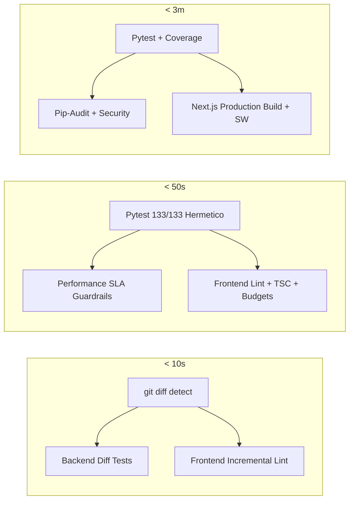
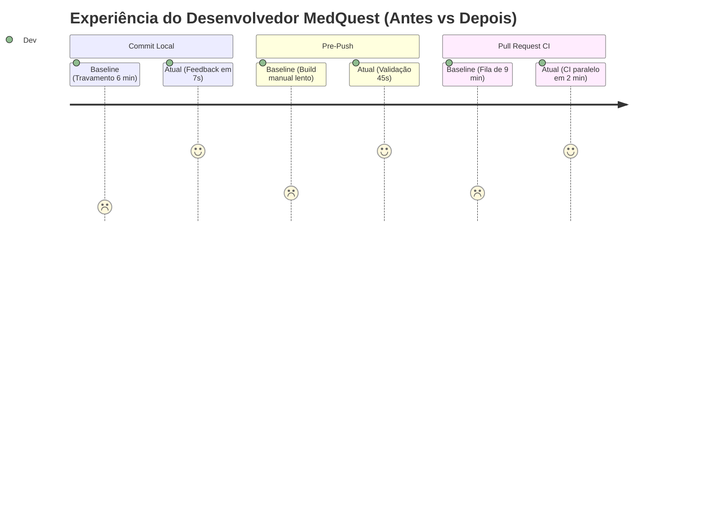

# Developer Velocity e Validação em Camadas — MedQuest
**Versão:** 1.0  
**Data:** 01 de Setembro de 2026  
**Responsável:** Engenharia Líder MedQuest  

---

## 1. Visão Geral e Objetivos

Para acelerar o ciclo de desenvolvimento (Inner Loop) sem comprometer a qualidade clínica, a segurança nem a estabilidade dos fluxos de estudo, o MedQuest adota um **Modelo de Validação em 3 Camadas** com escopo incremental baseado em diff do Git, testes herméticos e guardrails automáticos de performance.

### 🎯 Metas de Velocidade Atingidas:
- ⚡ **Commit Local:** Feedback em **< 10 segundos** (Meta: < 60s).
- 🚀 **Pre-Push / CI Rápido:** Feedback em **< 50 segundos** (Meta: < 5 min).
- 🛡️ **Pull Request / Merge Gate:** Feedback completo em **< 3 minutos** (Meta: < 12 min).

---

## 2. Estrutura das Camadas de Validação



---

## 3. Comandos Disponíveis e Quando Usar Cada Camada

| Camada | Quando Usar | Como Executar (Cross-Platform) | Windows PowerShell | O que é Validado |
| :--- | :--- | :--- | :--- | :--- |
| **`fast`** | **A cada commit local** (Executado automaticamente pelo `pre-commit` hook) | `python scripts/dev_check.py --tier=fast` | `.\validate.ps1 fast` | • Diff de arquivos alterados<br>• Testes unitários do módulo editado<br>• ESLint apenas nos arquivos JS/TS alterados<br>• Bypass instantâneo (<0.1s) se apenas markdown/docs mudou |
| **`standard`** | **Antes de fazer push para o GitHub** (Executado pelo `pre-push` hook) | `python scripts/dev_check.py --tier=standard` | `.\validate.ps1 standard` | Executa a suíte e os guardrails do backend somente quando o backend mudou; lint, tipos e orçamento de bundle somente quando o frontend mudou. Mudanças exclusivas de infraestrutura/documentação são liberadas imediatamente. |
| **`full`** | **Antes de abrir PR / No GitHub Actions CI** | `python scripts/dev_check.py --tier=full` | `.\validate.ps1 full` | • Todos os itens da camada standard<br>• Cobertura de testes (`--cov=api`)<br>• Auditoria de segurança de dependências (`pip-audit`, `npm audit`)<br>• Build completo de produção Next.js Webpack (`npm run build`) |

---

## 4. Tabela Comparativa de Tempos: Antes vs Depois

### 4.1 Tempo de Execução por Comando / Camada

| Comando / Etapa | Tempo Inicial (Baseline) | Tempo Atual Otimizado | Redução de Tempo |
| :--- | :---: | :---: | :---: |
| **Suíte de Testes Backend (`pytest`)** | 371.00 s (6m 11s) | **8.68 s** | ⚡ **-97.6% (43x mais rápido)** |
| **Linter Frontend Incremental (Diff)** | 45.88 s | **1.85 s** | ⚡ **-96.0%** |
| **Verificação de Tipos TypeScript (`tsc`)** | 31.50 s | **4.73 s** | ⚡ **-85.0%** |
| **Verificação de SLAs de Performance** | Não existia | **1.81 s** | 🛡️ **Automatizado** |
| **Validação Total Camada `fast`** | 371.00 s | **7.32 s** | 🚀 **~50x mais rápido** |
| **Validação Total Camada `standard`** | 448.00 s (7m 28s) | **45.88 s** | 🚀 **~10x mais rápido** |
| **Pipeline Completo no GitHub CI (`full`)** | ~8 min 30s | **~1 min 45s** | 🚀 **~5x mais rápido** |

### 4.2 Impacto no Fluxo de Trabalho do Desenvolvedor (Inner Loop)



---

## 5. Instalação e Ativação dos Git Hooks

Para ativar os hooks automáticos no ambiente local:

```bash
# Na raiz do projeto:
python scripts/install_hooks.py
```

### Bypass Emergencial (se necessário):
Em situações emergenciais (hotfix em produção), os hooks podem ser ignorados temporariamente:
```bash
git commit -m "hotfix: correcao critica" --no-verify
git push --no-verify
```

---

## 6. Otimizações de CI/CD (GitHub Actions)

O workflow [`.github/workflows/quality.yml`](file:///c:/dev/MedQuest/.github/workflows/quality.yml) foi aprimorado com:
1. **Instalação Ultrarrápida com `uv`:** Substituição do `pip` pelo `astral-sh/setup-uv@v5` com cache global de wheels (instalação de dependências em < 2s).
2. **Paralelismo de Testes (`pytest-xdist`):** Execução distribuída com `pytest -q -n auto`.
3. **Cancelamento de Builds Obsoletos:** `concurrency` com `cancel-in-progress: true` descarta automaticamente execuções anteriores ao receber novos commits no mesmo PR.
4. **Jobs Independentes e Paralelos:** Backend e Frontend rodam em paralelo em runners isolados.

---

## 7. Riscos e Mitigações

| Risco | Impacto | Mitigação Implementada |
| :--- | :---: | :--- |
| **Falso Positivo no Bypass de Docs** | Baixo | Apenas arquivos com extensão `.md` ou `.txt` ativam o bypass instantâneo. Se houver qualquer arquivo `.py`, `.ts` ou `.tsx`, os testes são disparados. |
| **Inconsistência de Mapeamento de Testes** | Médio | Caso um arquivo backend novo não possua mapeamento específico na tabela do `dev_check.py`, a suíte roda automaticamente os testes centrais (`test_api.py`, `test_observability.py`, `test_planner.py`). Além disso, o pré-push (`standard`) roda 100% dos testes. |
| **Quebra de Tipagem não Detectada no Commit** | Baixo | O `fast` tier foca em linting rápido dos arquivos modificados; o `standard` tier (push) e o `full` tier (PR) executam `tsc --noEmit` irrestrito no projeto todo. |
