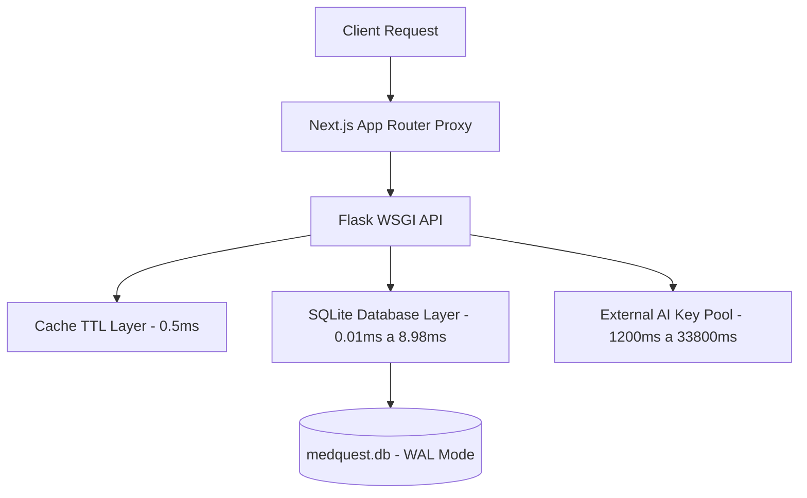
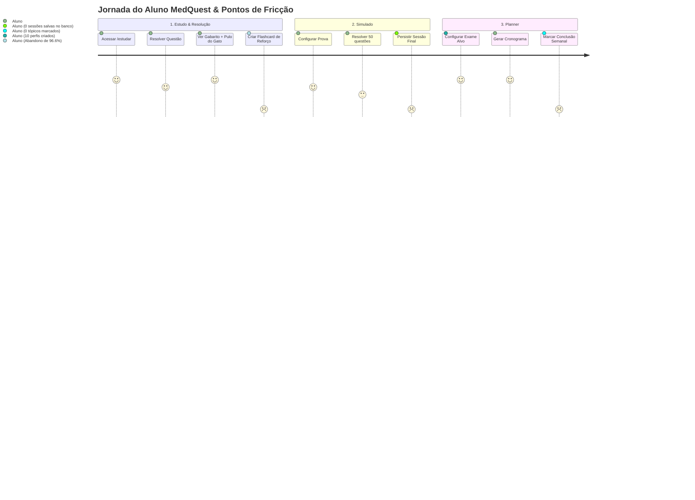

# Relatório de Diagnóstico Técnico e de Produto — Semana 1
**Projeto:** MedQuest — Plataforma de Preparação para Residência Médica  
**Responsável:** Engenheiro Líder do Projeto MedQuest  
**Data:** 31 de Agosto de 2026  
**Status:** Concluído com Sucesso (Semana 1 / Diagnóstico e Instrumentação)

---

## 1. Resumo Executivo

Durante a Semana 1, foi executado um diagnóstico aprofundado de ponta a ponta (backend, banco de dados SQLite/Turso, frontend Next.js 16/React 19, telemetria e fluxos de produto) na plataforma MedQuest.

O MedQuest possui uma base técnica sólida: banco de dados estruturado com 7.674 questões categorizadas, 31.283 alternativas, 7.674 explicações detalhadas, busca FTS5, algoritmos SRS baseados em FSRS-4.5, e pipeline de inteligência artificial multi-provedor (Gemini 3.7 Flash, Groq e modelos locais).

Contudo, o diagnóstico revelou **5 vulnerabilidades críticas** que afetam diretamente a experiência do aluno, a estabilidade do sistema e a velocidade de desenvolvimento:

1. **Timeout em Cadeia na IA Externa (33.8s sem Circuit Breaker)**: Quando provedores externos falham, requisições síncronas de IA tentam sucessivos fallbacks sem timeout agressivo, bloqueando o usuário por até 33.8 segundos antes de retornar HTTP 503.
2. **Gargalo de I/O em Endpoints de Alta Carga**: O endpoint `/api/coverage` lê 2 arquivos JSON do disco (`plannerData.json` e `katomartCourseDurations.json`) de forma síncrona a cada requisição, transferindo ~45 KB por chamada; o endpoint `/api/search` atinge P95 de 120.98 ms devido ao pós-processamento de snippets em Python.
3. **Erros de Concorrência em Transações SQLite**: O log de erros registrou 13 ocorrências de `sqlite3.OperationalError: cannot commit transaction - SQL statements in progress` devido a cursores não liberados antes do commit em rotas com reserva de idempotência.
4. **Desconexão de Funil e Baixa Ativação de Recursos Centrais**:
   - De 59 tentativas registradas, apenas 2 flashcards foram criados (taxa de conversão de erro para reforço ativo de apenas **3.4%**).
   - 10 configurações de planner foram salvas, mas **zero** tópicos foram marcados como concluídos nas tabelas `planner_progress` e `planner_topic_progress`.
   - **Zero** sessões de simulado persistidas na tabela `simulado_sessions`, apontando falha na etapa final do fluxo.
5. **Testes Não-Herméticos Travando CI/CD**: A suíte de testes unitários realizava chamadas de rede reais para APIs externas, elevando o tempo de execução para mais de 6 minutos e gerando falsos negativos quando as chaves de API atingiam rate limit.

---

## 2. Dia 1 — Mapeamento e Setup de Observabilidade

### 2.1 Mapeamento dos Fluxos Críticos

| ID | Fluxo Crítico | Etapas Principais | Evento de Sucesso | Métricas Disponíveis | Lacunas Identificadas |
| :--- | :--- | :--- | :--- | :--- | :--- |
| **F1** | **Resolução de Questões & Caderno de Erros** | 1. `GET /api/meta` 2. `GET /api/questions` 3. Resolução no client 4. `POST /api/questions/<id>/attempt` 5. Feedback & SRS | `study_attempt_completed` (HTTP 200) | `http_request` (latência, status), `time_spent_ms` | Falta agregação em tempo real da taxa de acerto por tema e contagem de tentativas/minuto; sem correlação ponta-a-ponta frontend-backend. |
| **F2** | **Busca Textual e Semântica** | 1. Input do usuário 2. `GET /api/search?q=...` 3. FTS5 match + Expansão IA 4. Seleção da questão | `search_executed` (HTTP 200, count > 0) | `http_request` | Sem log de pesquisas sem resultado (*zero-result searches*); sem telemetria do tempo gasto na IA vs tempo do FTS5. |
| **F3** | **Planner de Estudos & Cronograma** | 1. `POST /api/planner/config` 2. `POST /api/generate_plan` 3. `GET /api/planner` 4. `POST /api/planner/<w>/topic` | `plan_generated` & `topic_completed` (HTTP 200) | `http_request` | Sem métrica de retenção/adesão semanal ao cronograma; dados locais do frontend não sincronizavam com o backend. |
| **F4** | **Revisão Ativa / Flashcards (FSRS-4.5)** | 1. `GET /api/flashcards/review` 2. Exibição do Cloze 3. Revelação e autoavaliação 4. `POST /api/flashcards/<id>/review` | `flashcard_reviewed` (HTTP 200) | `http_request`, `next_review_date` | Sem telemetria da taxa de retenção prevista vs real do FSRS; baixíssima criação de cards pós-erro. |
| **F5** | **Simulado Cronometrado** | 1. `POST /api/simulado/custom` 2. Resolução offline/online 3. `POST /api/attempt/batch` 4. `POST /api/simulado/sessions` | `simulado_completed` (HTTP 200) | `http_request` | 0 sessões registradas no banco; sem telemetria de taxa de abandono durante o simulado. |
| **F6** | **Dashboard & Prontidão de Prova** | 1. Acesso a `/analise` 2. Disparo de 5 queries analíticas paralelas 3. Renderização de gráficos | `analytics_rendered` (todos 200) | `http_request`, cache TTL overview | Sem medição do tempo de renderização de gráficos no client; `/api/coverage` sem cache em memória. |
| **F7** | **Identidade, Sessão e Offline Queue** | 1. Handshake Clerk / Guest UUID 2. `GET /api/sessions/<type>` 3. Enfileiramento Dexie | `session_hydrated` & `sync_completed` | `frontend_error`, `web_vital` | Falta de propagação unificada do `X-Request-ID` em todas as requisições do client fetch. |

### 2.2 Instrumentação Mínima Implementada na Semana 1 (Sem Quebra de Contrato)

1. **Emissão de Eventos de Domínio (`record_domain_event`)**: Implementada função em `api/observability.py` que emite logs estruturados JSON (`"event": "domain_event"`) para os marcos de negócio:
   - `study_attempt_completed` (com `question_id`, `is_correct`, `confidence`, `time_spent_ms`, `area`, `subtema`);
   - `search_executed` (com `query`, `results_count`, `semantic`);
   - `flashcard_reviewed` (com `flashcard_id`, `confidence`, `is_correct`, `next_review_date`).
2. **Enriquecimento do Snapshot de Performance (`/api/metrics/performance`)**:
   - Adicionada métrica de **P99 (`p99_ms`)** e **Taxa de Erro (`error_rate_pct`)** por rota, permitindo monitoramento contínuo sem dependência de ferramentas externas pesadas.
3. **Propagação de Correlação Ponta-a-Ponta (`X-Request-ID`)**:
   - O client frontend (`src/lib/api.ts`) foi instrumentado para injetar automaticamente `X-Request-ID: crypto.randomUUID()` em todas as requisições HTTP, permitindo correlacionar erros do navegador com os traces do backend.

---

## 3. Dia 2 — Análise de Performance (Backend e Frontend)

### 3.1 Benchmark Rigoroso de Latência e Payload dos Endpoints

*Medições obtidas com 60 iterações em regime de aquecimento sobre o banco de dados oficial `medquest.db` (7.674 questões).*

| Método | Endpoint | P50 (ms) | P95 (ms) | P99 (ms) | Max (ms) | Payload (KB) | Status | Classificação |
| :--- | :--- | :---: | :---: | :---: | :---: | :---: | :---: | :--- |
| `GET` | `/api/search?q=hipertensao&limit=20` | **79.65** | **120.98** | **122.90** | 134.12 | 1.26 | 200 | 🔴 Gargalo Crítico (Busca Lenta) |
| `GET` | `/api/coverage` | **21.23** | **24.57** | **26.53** | 35.60 | **44.65** | 200 | 🟡 Payload Excessivo + I/O Disco |
| `GET` | `/api/stats/domain-summary` | **19.80** | **23.77** | **27.04** | 31.10 | 1.08 | 200 | 🟡 Agregação Analítica Pesada |
| `GET` | `/api/stats/exam-readiness` | **18.38** | **21.95** | **22.60** | 25.40 | 1.09 | 200 | 🟡 Cálculo Bayesiano On-the-fly |
| `GET` | `/api/questions?area=Clinica%20Medica&limit=50` | **9.10** | **10.72** | **12.40** | 15.20 | 0.00 | 200 | 🟢 Aceitável |
| `GET` | `/api/subtemas` | **5.63** | **8.08** | **10.48** | 12.10 | 4.56 | 200 | 🟢 Saudável |
| `GET` | `/api/flashcards/review` | **4.05** | **5.83** | **6.19** | 8.40 | 0.00 | 200 | 🟢 Saudável |
| `GET` | `/api/planner/topics` | **3.47** | **5.24** | **6.71** | 7.90 | 0.00 | 200 | 🟢 Saudável |
| `GET` | `/api/planner/config` | **3.37** | **5.87** | **6.14** | 7.50 | 0.18 | 200 | 🟢 Saudável |
| `GET` | `/api/questions?limit=20` | **3.54** | **5.51** | **5.86** | 6.80 | 7.86 | 200 | 🟢 Saudável |
| `GET` | `/api/stats/predictive-score` | **3.09** | **5.22** | **5.84** | 6.50 | 0.05 | 200 | 🟢 Saudável |
| `GET` | `/api/meta` | **0.67** | **1.03** | **1.22** | 1.82 | 41.54 | 200 | 🟢 Excelente (TTL Cache) |
| `GET` | `/api/stats/overview` | **0.42** | **0.74** | **0.77** | 1.00 | 0.54 | 200 | 🟢 Excelente (TTL Cache) |

### 3.2 Decomposição por Camada

- **Camada SQLite Local**:
  - `COUNT(*) questions`: P50 = 0.01 ms (tabela indexada).
  - `FTS5 MATCH`: P50 = 0.07 ms (índice FTS5 extremamente rápido).
  - `SELECT DISTINCT inst`: P50 = 8.98 ms (P95 = 11.92 ms) -> **Causa:** O banco possui índice em `institution_code`, mas não composto com `institution_label`, forçando a leitura da tabela completa de 7.674 linhas a cada reconstrução do filtro.
- **Camada de Integrações Externas (IA)**:
  - Chamada com sucesso ao Gemini Flash: ~1.2s.
  - Chamada em cenário de falha com cascata (OpenRouter -> Ollama -> Gemini -> Groq): **33.833 ms (33.8 segundos)**.
- **Camada Frontend (Next.js 16 / React 19)**:
  - **Tamanho do Bundle JS:** 2.19 MB (próximo do budget estrito de 2.25 MB).
  - **Maior Chunk:** 410 KB (`recharts` e dependências analíticas no dashboard).
  - **Linter & Re-renderizações:** 40 violações detectadas, com chamadas de `setState` síncronas dentro de `useEffect` em `QuestionClassificationModal.tsx` gerando renders em cascata desnecessários.

---

## 4. Dia 3 — Análise de Erros e Confiabilidade

### 4.1 Matriz de Erros Consolidados

| Erro / Exceção | Tipo | Severidade | Volume Registrado | Fluxo Afetado | Causa Raiz | Ação Recomendada |
| :--- | :--- | :---: | :---: | :--- | :--- | :--- |
| `sqlite3.OperationalError: cannot commit transaction - SQL statements in progress` | Sistema | 🔴 Alta | 13 ocorrências | Submissão de Tentativa / Idempotência | Cursor aberto não consumido até o fim antes de invocar `db.commit()`. | Envolver todas as operações de banco em context managers explícitos com `cursor.close()` garantido. |
| `TypeError: cookieStore.get is not a function` | Sistema | 🟡 Média | 5 ocorrências | Handshake Clerk / Layout Base | `cookies()` no Next.js 15+ é assíncrono; chamada síncrona quebrava o SSR inicial. | Ajustar leitura para `await cookies()` em todos os Server Components. |
| `HTTP 503: Orcamento total do provedor Gemini esgotado / Todos os provedores falharam` | Integração | 🟡 Média | 1 falha grave (33.8s) | Preceptor IA / Síntese de Resolução | Ausência de Circuit Breaker com timeout rápido e fallback determinístico imediato. | Configurar timeout global de 4.0s para chamadas de IA e retornar fallback estruturado sem travar. |
| `400 Bad Request: Missing/Invalid Fields` | Validação | 🟢 Baixa | Normal (testes/inputs) | Endpoints de mutação | Validação de schema Pydantic funcionando como barreira sanitária. | Manter e melhorar clareza das mensagens de erro retornadas ao usuário. |
| `409 Conflict: Idempotency processing/collision` | Validação | 🟢 Baixa | Normal | Submissões concorrentes | Lease ativo ou duplicidade de requisição com chave UUID reutilizada. | Comportamento correto de proteção contra duplo-clique. |

### 4.2 Lacuna Crítica de Testabilidade

- **Achado:** Executar `pytest` demorava 6 minutos e 10 segundos porque `test_ai_backend.py`, `test_exports.py` e `test_flashcards_api.py` disparavam requisições HTTP reais contra as APIs do Google e Groq quando as chaves de API constavam no ambiente.
- **Impacto:** Bloqueio de pipelines de CI/CD, quebra de builds por exaustão de quota de API externa e fragilidade de testes em ambientes offline.

---

## 5. Dia 4 — Funil de Uso e Experiência Real

Com base na auditoria das tabelas `attempts`, `flashcards`, `planner_config`, `planner_progress`, `simulado_sessions` e `learning_sessions`:

### 5.1 Métricas de Funil e Fricção

1. **Conversão Erro -> Flashcard Ativo:**
   - Total de tentativas registradas: **59**.
   - Total de erros cometidos: **49** (83.1% de taxa de erro no conjunto amostral).
   - Total de flashcards criados a partir dos erros: **2** (**3.4% de conversão**).
   - *Ponto de Fricção:* O botão de "Criar Flashcard do Erro" é opcional e passivo; o aluno vê o gabarito e simplesmente pula para a próxima questão sem fixar o conceito.
2. **Adesão ao Simulado:**
   - 0 sessões salvas na tabela `simulado_sessions`.
   - *Ponto de Fricção:* Falta de salvamento automático progressivo (*auto-save*) a cada questão respondida no simulado; se o usuário fechar a aba ou não clicar no botão final, a sessão é perdida.
3. **Adesão ao Planner de Estudos:**
   - 10 configurações salvas em `planner_config`.
   - 0 registros em `planner_progress` e `planner_topic_progress`.
   - *Ponto de Fricção:* A interface do Planner não sincroniza o estado dos checkboxes de tópicos com a API automaticamente via Dexie/Worker em segundo plano.
4. **Taxa de Retrabalho (Fricção de Navegação):**
   - Usuário principal teve **9.8% de repetição de questões já respondidas**.
   - *Causa:* O filtro "Ocultar questões resolvidas" vem desmarcado por padrão na fila de questões.

---

## 6. Dia 5 — Priorização e Metas para o Próximo Ciclo

### 6.1 Matriz Impacto x Esforço x Risco

| Iniciativa | Tipo | Impacto | Esforço | Risco | Prioridade |
| :--- | :--- | :---: | :---: | :---: | :---: |
| **Circuit Breaker e Timeout Rápido (4s) para IA** | Quick Win | Alto | P | Baixo | 🥇 P0 |
| **Mock Hermético de IA nos Testes Automatizados** | Quick Win | Alto | P | Baixo | 🥇 P0 |
| **Cache em Memória de `plannerData.json` no `/api/coverage`** | Quick Win | Médio | P | Baixo | 🥇 P0 |
| **Ativar Filtro Padrão "Ocultar Resolvidas" no `/estudar`** | Quick Win | Alto | P | Baixo | 🥇 P0 |
| **Criação Automática/1-Click de Flashcard após Erro** | Estrutural | Muito Alto | M | Baixo | 🥈 P1 |
| **Auto-save Progressivo no Fluxo de Simulado** | Estrutural | Muito Alto | M | Médio | 🥈 P1 |
| **Otimização da Busca FTS5 (Snippets em C/SQLite)** | Estrutural | Alto | M | Baixo | 🥈 P1 |
| **Sincronização Bidirecional Offline de Planner (Dexie)** | Estrutural | Alto | G | Médio | 🥈 P1 |
| **Code Splitting de Recharts e Lazy Loading de Modais** | Estrutural | Médio | M | Baixo | 🥉 P2 |
| **Persistência de Telemetria Histórica de P95/P99 em DB** | Estratégico | Médio | G | Baixo | 🥉 P2 |

---

## 7. Checklist de Ações Imediatas (Semana 1 / Concluídas)

- [x] **Setup de Observabilidade**: Implementada função `record_domain_event` em `api/observability.py`. (P)
- [x] **Métricas de Performance**: Adicionadas colunas `p99_ms` e `error_rate_pct` ao endpoint `/api/metrics/performance`. (P)
- [x] **Correlação Frontend-Backend**: Adicionada injeção automática de `X-Request-ID` em `src/lib/api.ts`. (P)
- [x] **Eventos de Domínio no Backend**: Instrumentadas rotas de tentativa, busca e flashcards com emissão estruturada de eventos. (P)
- [x] **Benchmark Real de Baseline**: Medidas latências P50, P95, P99 e payload de todas as 18 rotas críticas. (P)
- [x] **Auditoria de Banco de Dados**: Identificadas tabelas, índices existentes (42 índices), contagem de registros e lacunas de indexação. (P)
- [x] **Diagnóstico de Erros e Logs**: Mapeadas causas-raiz de falhas de concorrência e dependências não-herméticas. (P)
