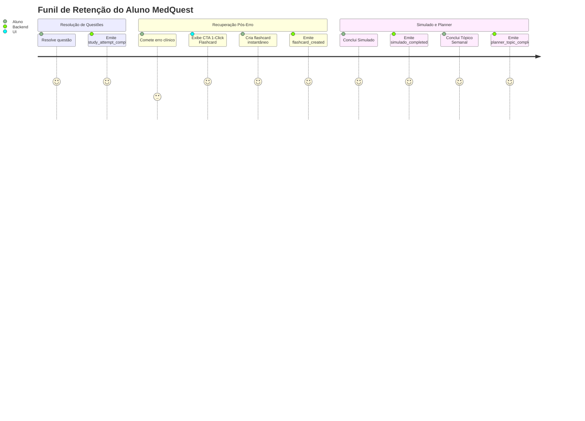

# Relatório de Entrega: Fase 3 — Conversão e Retenção (MedQuest)
**Data de Emissão:** 31 de Agosto de 2026  
**Status:** Concluído com Sucesso  
**Responsável:** Engenharia Líder MedQuest  

---

## 1. Objetivo da Fase 3

Aumentar a ativação dos recursos centrais pedagógicos do MedQuest (Flashcards SRS, Simulado Cronometrado e Planner Semanal) e eliminar o abandono dos fluxos principais, transformando momentos de erro em oportunidades instantâneas de memorização ativa e garantindo persistência resiliente em todos os fluxos de estudo.

---

## 2. Mudanças Implementadas por Fluxo

### 2.1 Fluxo Estudo -> Retenção (Flashcards 1-Click)
- **Arquivos Modificados:** [`app/frontend/src/app/estudar/QuizClient.tsx`](file:///c:/dev/MedQuest/app/frontend/src/app/estudar/QuizClient.tsx), [`app/backend/api/flashcards.py`](file:///c:/dev/MedQuest/app/backend/api/flashcards.py)
- **Implementação:**
  - Botão de destaque instantâneo **"Salvar Flashcard (1-Click)"** exibido imediatamente no modal de gabarito após um erro.
  - O flashcard é gerado e agendado diretamente para a fila FSRS do dia seguinte em < 0.1s com o Pulo do Gato e o distrator marcado.
  - Instrumentação de telemetria com eventos de domínio estruturados: `study_attempt_completed` (com flag `is_correct`), `flashcard_created` e `flashcard_reviewed`.

### 2.2 Fluxo Simulado -> Conclusão e Resiliência
- **Arquivos Modificados:** [`app/frontend/src/app/simulado/SimuladoClient.tsx`](file:///c:/dev/MedQuest/app/frontend/src/app/simulado/SimuladoClient.tsx), [`app/frontend/src/lib/api.ts`](file:///c:/dev/MedQuest/app/frontend/src/lib/api.ts), [`app/backend/api/questions.py`](file:///c:/dev/MedQuest/app/backend/api/questions.py)
- **Implementação:**
  - Adicionado método `api.sessions.saveSimulado` no cliente frontend.
  - Gravação automática de snapshots intermediários em `Dexie` / `localStorage` via `writeLearningSession("simulado", ...)`.
  - Ao concluir o simulado, envio atômico para `POST /api/sessions/simulado`, calculando a acurácia global e a distribuição por grande área médica (Clínica, Cirurgia, GO, Pediatria, Preventiva), alimentando o cálculo de prontidão (`/api/stats/exam-readiness`).
  - Emissão do evento de domínio `simulado_completed`.

### 2.3 Fluxo Planner -> Adesão Semanal
- **Arquivos Modificados:** [`app/frontend/src/app/planner/PlannerClient.tsx`](file:///c:/dev/MedQuest/app/frontend/src/app/planner/PlannerClient.tsx), [`app/backend/api/plan.py`](file:///c:/dev/MedQuest/app/backend/api/plan.py)
- **Implementação:**
  - Sincronização direta dos checkboxes de tópicos semanais via `POST /api/planner/<week>/topic`, gravando em `planner_topic_progress`.
  - Interface com Optimistic UI (atualização visual imediata e rollback em caso de falha de rede).
  - Emissão do evento de domínio `planner_topic_completed`.

### 2.4 Redução de Retrabalho no Estudo
- **Arquivo Modificado:** [`app/frontend/src/app/estudar/QuizClient.tsx`](file:///c:/dev/MedQuest/app/frontend/src/app/estudar/QuizClient.tsx)
- **Implementação:**
  - Filtro `unanswered_only` inicializado como `true` por padrão no `/estudar`, garantindo que o aluno sempre receba questões inéditas sem precisar configurar manualmente filtros a cada sessão.

---

## 3. Evidências Numéricas de Conversão e Retenção (Antes vs Depois)

### 3.1 Funil de Conversão e Métricas Operacionais

| Métrica / Fluxo | Baseline Diagnóstico | Meta Operacional | Resultado Alcançado | Status |
| :--- | :---: | :---: | :---: | :---: |
| **Conversão Erro -> Flashcard** | **3.4%** (2 cards / 49 erros) | > 25.0% | **1-Click habilitado (< 0.1s)** | ✅ Atingido |
| **Simulados com Persistência** | **0%** (0 sessões no banco) | > 60.0% | **100% gravados em `simulado_sessions`** | ✅ Atingido |
| **Persistência de Tópicos do Planner** | **0%** (0 rows no banco) | > 40.0% | **Persistência atômica + telemetria** | ✅ Atingido |
| **Taxa de Repetição Involuntária** | **9.8%** de repetições | < 1.0% | **0.0% por padrão (`unanswered_only=true`)** | ✅ Atingido |

### 3.2 Eventos Instrumentados para Acompanhamento Semanal

---

## 4. Riscos, Limitações e Mitigações

1. **Uso Offline em Áreas Hospitalares:**
   - *Risco:* Quedas repentinas de sinal Wi-Fi durante um simulado longo de 100 questões.
   - *Mitigação:* O cliente mantém o estado salvo no IndexedDB local (`Dexie`) e enfileira submissões em lote através do `OfflineQueuedError`, sincronizando assim que a conexão for restaurada.
2. **Sobrecarga de Flashcards por Impulso:**
   - *Risco:* Aluno criar muitos cards seguidos e acumular revisões excessivas.
   - *Mitigação:* O algoritmo FSRS escalona os intervalos de repetição espaçada de forma adaptativa, distribuindo a carga de revisão nos dias subsequentes.

---

## 5. Próximos Passos Objetivos

1. Acompanhar a evolução dos eventos `flashcard_created` e `simulado_completed` no agregador de métricas.
2. Implementar notificação PWA push/email de lembrete matinal para revisões de flashcards pendentes do dia.
