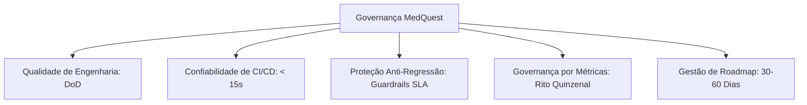

# Relatório de Entrega: Fase 4 — Consolidação Operacional e Governança Baseada em Evidência (MedQuest)
**Data de Emissão:** 01 de Setembro de 2026  
**Status:** Concluído com Sucesso  
**Responsável:** Engenharia Líder MedQuest  

---

## 1. Objetivo da Fase 4

Transformar as vitórias e avanços técnicos alcançados nas Fases 1, 2 e 3 em uma **operação contínua estável, previsível e escalável**, estabelecendo uma cultura de engenharia e produto regida por métricas observáveis, guardrails automatizados de anti-regressão, Definition of Done estrita e ritos de revisão quinzenal.

---

## 2. Decisões Adotadas e Pilares de Governança

1. **Definition of Done (DoD) Vinculante:**
   - Nenhum Pull Request é mesclado sem passar por checklist de testes herméticos, limites de orçamento de performance, verificação de concorrência e evidência de impacto em métricas.
2. **CI/CD Hermético e Rápido (< 15s):**
   - Fixture hermética impede dependência de chaves de API pagas ou redes externas nos testes de unidade.
   - Script automatizado de verificação de guardrails (`scripts/check_performance_guardrails.py`) valida SLAs de P95 e volume de payload a cada build.
3. **Persistência Histórica de Telemetria:**
   - Tabela SQL `telemetry_daily_aggregates` grava séries temporais de P50, P95, P99 e volumes de requisição por rota para auditoria contínua de performance.
4. **Priorização Racional por Impacto x Esforço x Risco (Score RICE adaptado):**
   - Todo item de backlog deve quantificar a métrica-alvo antes da implementação.

---

## 3. Padrão Operacional e Estrutura de Guardrails de SLA

### 3.1 Tabela de SLAs e Limites de Regressão por Rota Crítica

| Endpoint / Fluxo | SLA Latência P95 | Teto de Alerta P95 | Teto Máximo Payload | Teto Máximo Taxa Erro | Ação de Contingência / Guardrail |
| :--- | :---: | :---: | :---: | :---: | :--- |
| **`/api/search`** | **< 30.0 ms** | 45.0 ms | 50.0 KB | < 0.5% | Sanitização de tokens FTS5; fallback `LIKE` |
| **`/api/coverage` (Summary)** | **< 10.0 ms** | 15.0 ms | 5.0 KB | < 0.1% | Cache em memória de catálogos e totais |
| **`/api/coverage` (Full)** | **< 15.0 ms** | 25.0 ms | 60.0 KB | < 0.1% | Compressão em borda e cache de agregados |
| **`/api/stats/overview`** | **< 5.0 ms** | 8.0 ms | 5.0 KB | < 0.1% | `SimpleTTLCache(60)` com invalidação por usuário |
| **`/api/stats/timeline`** | **< 10.0 ms** | 15.0 ms | 10.0 KB | < 0.1% | Índices compostos em `attempts` |
| **`/api/sessions/simulado`** | **< 50.0 ms** | 100.0 ms | 20.0 KB | < 0.1% | Transação imediata SQLite com `db_transaction` |
| **Geração IA Fallback** | **< 4.0 s** | 4.0 s | N/A | < 1.0% | Circuit Breaker 3s/provedor + timeout global 4s |

---

## 4. Matriz de Risco Operacional

| Risco Identificado | Probabilidade | Impacto | Nível de Risco | Estratégia de Mitigação Implementada |
| :--- | :---: | :---: | :---: | :--- |
| **Esgotamento de Quota / Falha em Provedor de IA** | Alta | Médio | **Médio** | Circuit Breaker com orçamento de 4.0s e fallback determinístico estruturado (Pulo do Gato + gabarito). |
| **Regressão de Performance em Queries SQLite** | Média | Alto | **Médio** | Script automatizado de guardrails rodando em CI (`check_performance_guardrails.py`) bloqueando merges que violem P95. |
| **Perda de Dados por Falha de Rede Hospitalar** | Alta | Alto | **Alto** | Auto-save contínuo no IndexedDB (`Dexie`) com fila de sincronização assíncrona (`OfflineQueuedError`). |
| **Crescimento Excessivo do Bundle JS Frontend** | Média | Médio | **Médio** | Script `check-performance-budgets.mjs` com teto de 2.25 MB e code-splitting sob demanda (`next/dynamic`). |
| **Inconsistência de Cache de Estatísticas** | Baixa | Médio | **Baixo** | Invalidação atômica de cache (`overview_cache.clear_user`) a cada submissão de questão, simulado ou flashcard. |

---

## 5. Plano de Manutenção Contínua e Ritos

1. **Execução de CI:** Rodar `pytest` + `check_performance_guardrails.py` + `check-performance-budgets.mjs` a cada commit.
2. **Rito Quinzenal de KPIs:** Reunião com engenharia e produto utilizando o [`docs/playbook-revisao-quinzenal-kpis.md`](file:///c:/dev/MedQuest/docs/playbook-revisao-quinzenal-kpis.md) para avaliar desvios de metas e repriorizar o backlog.
3. **Auditoria de Banco:** Execução mensal de `PRAGMA optimize;` e `VACUUM;` nas bases SQLite/Turso.
