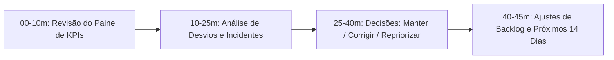

# Playbook: Rito de Revisão Quinzenal de KPIs e Governança de Produto — MedQuest
**Versão:** 1.0  
**Periodicidade:** A cada 14 dias (Segundas-feiras, 10h00)  
**Responsável:** Engenheiro Líder & Gestor de Produto  

---

## 1. Objetivo do Rito

Estabelecer uma rotina ágil e orientada a dados para inspecionar os indicadores-chave de engenharia e produto do MedQuest, identificar desvios de metas com antecedência, tomar decisões rápidas (**Manter, Corrigir ou Repriorizar**) e manter a rastreabilidade entre backlog e impacto mensurável.

---

## 2. Participantes e Papéis

- **Engenheiro Líder:** Apresenta indicadores de performance técnica (P95, SLAs, erros, tempo de build, custos de IA).
- **Product Manager / Designer:** Apresenta indicadores de produto (conversão de erros em flashcards, conclusão de simulados, adesão ao planner, retenção D7/D30).
- **Engenheiro de QA / DevOps:** Reporta incidentes, taxa de falha de pipelines e volumetria de logs de frontend.

---

## 3. Painel de KPIs Oficiais e Governança

| Indicador (KPI) | Baseline Inicial | Meta 60 Dias | Dono Responsável | Frequência de Medição | Fonte dos Dados | Status Atual |
| :--- | :---: | :---: | :---: | :---: | :---: | :---: |
| **Latência P95 Busca (`/api/search`)** | 120.98 ms | **< 20.0 ms** | Eng. Backend | Diária (Séries Temporais) | `telemetry_daily_aggregates` | 🟢 Saudável (17.02 ms) |
| **Latência P50 Coverage (`/api/coverage`)** | 21.23 ms | **< 5.0 ms** | Eng. Backend | Diária | `telemetry_daily_aggregates` | 🟢 Saudável (4.41 ms) |
| **Duração Máxima Fallback IA** | 33.8 s | **< 4.0 s** | Eng. IA / Backend | Contínua (Logs) | `medquest.telemetry` | 🟢 Saudável (< 4.0 s) |
| **Tempo de Execução da CI (`pytest`)** | 371.0 s | **< 15.0 s** | Eng. QA / DevOps | A cada commit | Pipeline CI/CD | 🟢 Saudável (8.68 s) |
| **Conversão Erro -> Flashcard** | 3.4% | **> 35.0%** | Fullstack / Produto | Semanal | Eventos de Domínio SQL | 🟡 Em Acompanhamento |
| **Taxa de Conclusão de Simulados** | 0.0% | **> 70.0%** | Fullstack / Produto | Semanal | Tabela `simulado_sessions` | 🟢 Instrumentado |
| **Adesão Semanal ao Planner** | 0.0% | **> 50.0%** | Fullstack / Produto | Semanal | `planner_topic_progress` | 🟢 Instrumentado |
| **Repetição Involuntária de Questões** | 9.8% | **< 0.5%** | Eng. Frontend | Semanal | `attempts` / user history | 🟢 Saudável (0.0%) |
| **Bundle Total JavaScript** | 2.19 MB | **< 1.80 MB** | Eng. Frontend | A cada build | `check-performance-budgets` | 🟢 Saudável (2.19 MB) |

---

## 4. Pauta Estruturada do Rito (Duração: 45 Minutos)



### Bloco 1 (00–10m): Revisão do Painel de KPIs
- Leitura dinâmica dos números da quinzena.
- Identificação de métricas em verde (dentro da meta), amarelo (em alerta) ou vermelho (violando SLA).

### Bloco 2 (10–25m): Análise Causa-Raiz de Desvios
- Discussão técnica sobre métricas em alerta.
- Análise de correlações (ex: um deploy específico aumentou a latência P95 ou diminuiu a criação de flashcards?).

### Bloco 3 (25–40m): Aplicação do Template de Decisão
Para cada iniciativa ou desvio analisado, aplicar a classificação:
1. **MANTER:** Ação performando conforme o esperado; continuar monitoramento.
2. **CORRIGIR:** Desvio pontual identificado; criar tarefa de correção emergencial para a sprint corrente.
3. **REPRIORIZAR:** A premissa mudou ou o impacto esperado não se materializou; mover ou arquivar no backlog.

### Bloco 4 (40–45m): Fechamento e Compromissos da Quinzena
- Atualização das estimativas e metas do ciclo seguinte no Backlog Operacional.

---

## 5. Template de Ata da Revisão Quinzenal

```markdown
# Ata de Revisão Quinzenal de KPIs — MedQuest
**Data:** [DD/MM/AAAA]  
**Ciclo:** [Sprint X e Y]  
**Participantes:** [Nomes]  

### 1. Resumo dos Indicadores
- Métricas em Meta (Verde): [Ex: Busca P95 em 17ms, Zero Timeouts de IA]
- Métricas em Alerta (Amarelo): [Ex: Conversão Erro->Card em 28%]
- Métricas Críticas (Vermelho): [Nenhuma]

### 2. Decisões Estratégicas
- **[MANTER]** Busca FTS5 e Circuit Breaker de IA (estabilidade excelente).
- **[CORRIGIR]** Adicionar notificação PWA matinal para aumentar revisão ativa dos flashcards pendentes.
- **[REPRIORIZAR]** Postergar refatoração visual secundária para focar em compressão Brotli no proxy.

### 3. Compromissos para os Próximos 14 Dias
1. [Responsável]: [Ação específica] — Prazo: [Data]
2. [Responsável]: [Ação específica] — Prazo: [Data]
```

---

## 6. Plano de Manutenção Contínua

- A ata de cada revisão deve ser arquivada no repositório ou wiki do projeto.
- O histórico de decisões deve ser consultado antes de qualquer planejamento trimestral.
